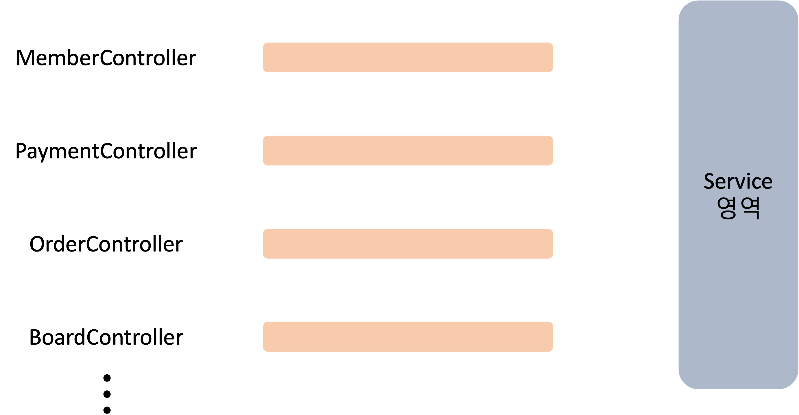
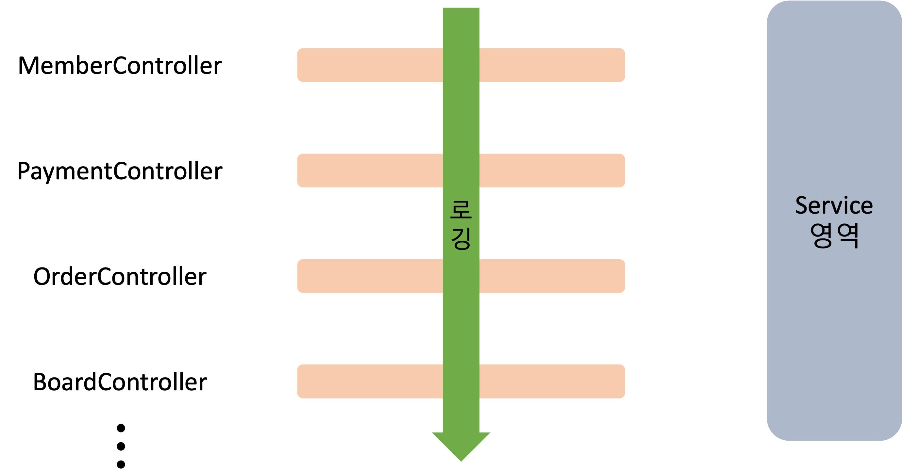

### AOP (Aspect Oriented Programming)
> 관점 지향 프로그래밍

어떤 로직을 기준으로 핵심적인 관점, 부가적인 관점으로 나누어서 보고 그 관점을 기준으로 각각 모듈화하겠다는 것

<br>
만약 아래와 같이 여러가지 Controller가 존재한다고 가정합니다.



그러나 Controller로 들어오는 요청마다 DB에 커스텀 로그를 남겨야한다고 가정합시다.  

AOP를 몰랐다면 다음과 같이 작성할 수 있겠습니다.
```java
@RestController
@RequiredArgsConstructor
@RequestMapping("/members")
public class MemberController {

    private final MemberService memberService;

    @GetMapping("/{memberId}")
    public ResponseEntity<?> getMemberInfo(@PathVariable Long memberId) throws Exception {
        /// TODO: Custom 로그 생성
        /// TODO: 로그 DB INSERT repository 호출
        /// ㄴ DB connection open
        /// ㄴ DB에 Custom 로그 INSERT
        /// ㄴ DB connection close

        MemberInfoResponseDto memberInfo = memberService.getMemberInfoById(memberId);
        return ResponseEntity.status(HttpStatus.OK).body(memberInfo);
    }
    ...
}
```
각 API 함수마다, Controller마다 작성을 할 수 없을 것입니다.


여기서 핵심적인 관점은 API가, DB에 커스텀 로그를 남기는 것이 부가적인 관점이라고 판단한다면 다음 그림처럼 AOP 적용 모습이 그려질 것입니다.



<br>

```java
// aop 빈 객체
@Aspect
@Component
public class ControllerCustomLog {
    @Around("execution(* com.example.controller.*(..))")
    public Object logging(ProceedingJoinPoint pjp) throws Throwable {        
        
        // DB INSERT repository 함수 호출
        
        return pjp;
    }
}
```

- @Aspect 어노테이션을 붙여 해당 클래스가 Aspect를 나타내는 클래스라는 것을 명시
- @Component 어노테이션을 붙여 스프링 빈으로 등록
- @Around 어노테이션을 통해 패키지 내 모든 Controller에 이 Aspect를 적용